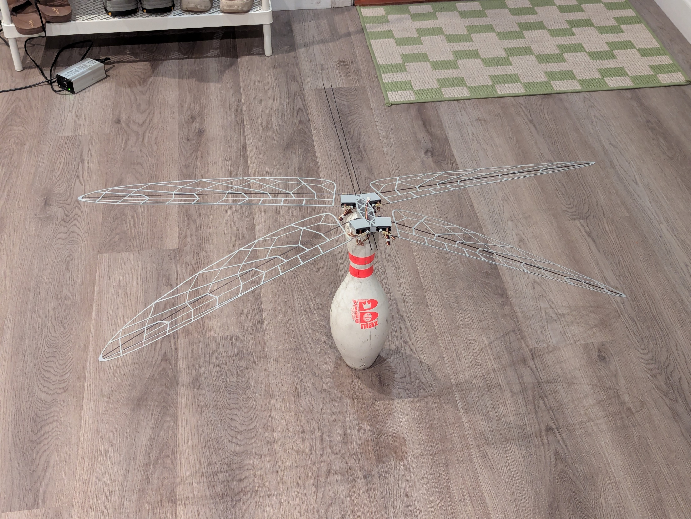
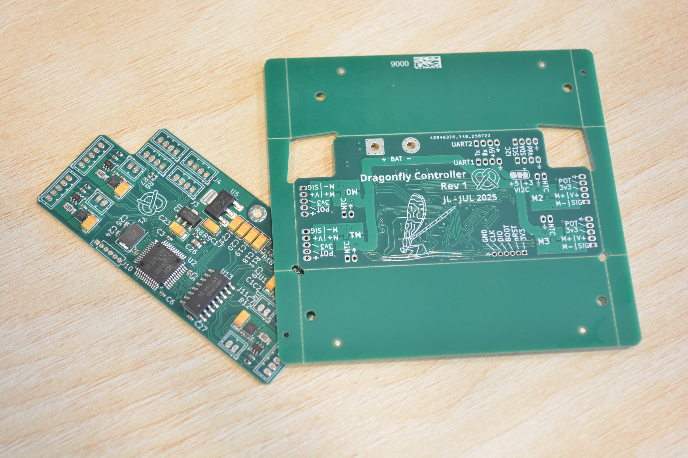

# Dragonfly Robot
This repository contains hardware and firmware files for a flight controller & 4-channel servo driver, intended for my dragonfly ornithopter robot.

## Robot hardware
The robot is built from components 3d printed out of lightweight PLA and pulltruded carbon fiber rods, with two standard 3.7g RC servos actuating each wing.

## PCB
The flight controlelr hardware is based on the WCH CH32V203, a low-cost RISC-V microcontroller.
Motor drives use the TI DRV8212 full-bridge driver and INA199 current sense amplifier for current feedback.
Each controller drives one pair of wings (four actuators). The controllers for each wing pair communicate with each other via I2C. An I2C IMU (MPU6050/MPU9250) is used for attitude control, and an RC receiver is connected over a serial link via the CRSF protocol.

## Firmware
The firmware in this repository utilizes CNLohr's [CH32Fun](https://github.com/cnlohr/ch32fun) framework for register mapping and hardware initialization functionality.
